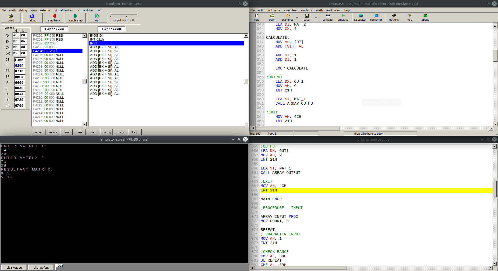
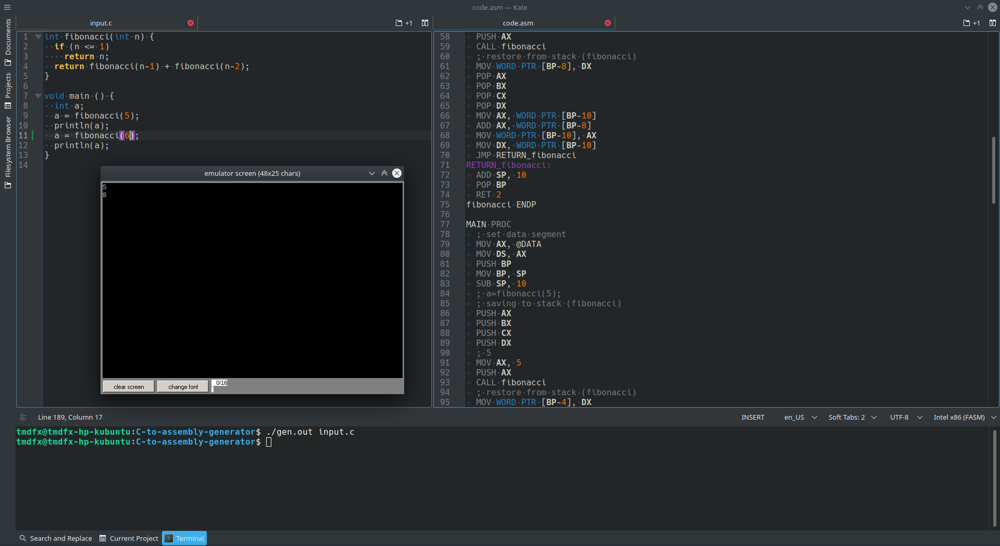

This repository is a collection of some of my works with assembly in the courses CSE-316 and CSE-310. The courses covered all basic topics like arithmetic and logic instructions, conditional, loops, stacks and procedures, arrays, addressing modes, etc. The implementations were done for Microsoft MACRO assembler (MASM) and utilized the [Intel Microprocessors](https://www.amazon.com/Intel-Microprocessors-8th-Barry-Brey/dp/0135026458) book as a reference. The emulator [Emu8086](https://emu8086.en.lo4d.com/windows) was used to run and test all the generated assembly code!

## Offline 1: Basics of 8086 Assembly

**Instructions**: [[PDF]](/1-basics/instructions.pdf/)

**Implementation 1**: Basic arithmetic [[Code]](/1-basics/1.asm)

**Implementation 2**: Uppercase to lowercase, 1's complement conversion [[Code]](/1-basics/2.asm)

## Offline 2: Conditional statements

**Instructions**: [[PDF]](/2-conditionals/instructions.pdf/)

**Implementation 1**: Second highest number [[Code]](/2-conditionals/1.asm)

**Implementation 2**: Password strength checker [[Code]](/2-conditionals/2.asm)

## Offline 3: Procedures and loops

**Instructions**: [[PDF]](/3-loops/instructions.pdf/)

**Implementation 1**: Multi-digit number arithmetic [[Code]](/3-loops/1.asm)

## Offline 4: Array, string and recursion

**Instructions**: [[PDF]](/4-array-strings-recursion/instructions.pdf/)

**Implementation 1**: Matrix addition [[Code]](/4-array-strings-recursion/1.asm)

**Implementation 2**: Fibonacci number [[Code]](/4-array-strings-recursion/2.asm)

## C to Assembly generator

A compiler front-end implementation done for CSE-310. `flex`-`bison` was used to construct the compiler and assembly was selected as the intermediate representation. This compiler supports a subset of the actual C language. The file [`works.c`](/C-to-assembly-generator/works.c) contains some sample code supported by the compiler.

**Run**: `./gen.out <input-file>` should generate a `code.asm` file which contains the converted code
